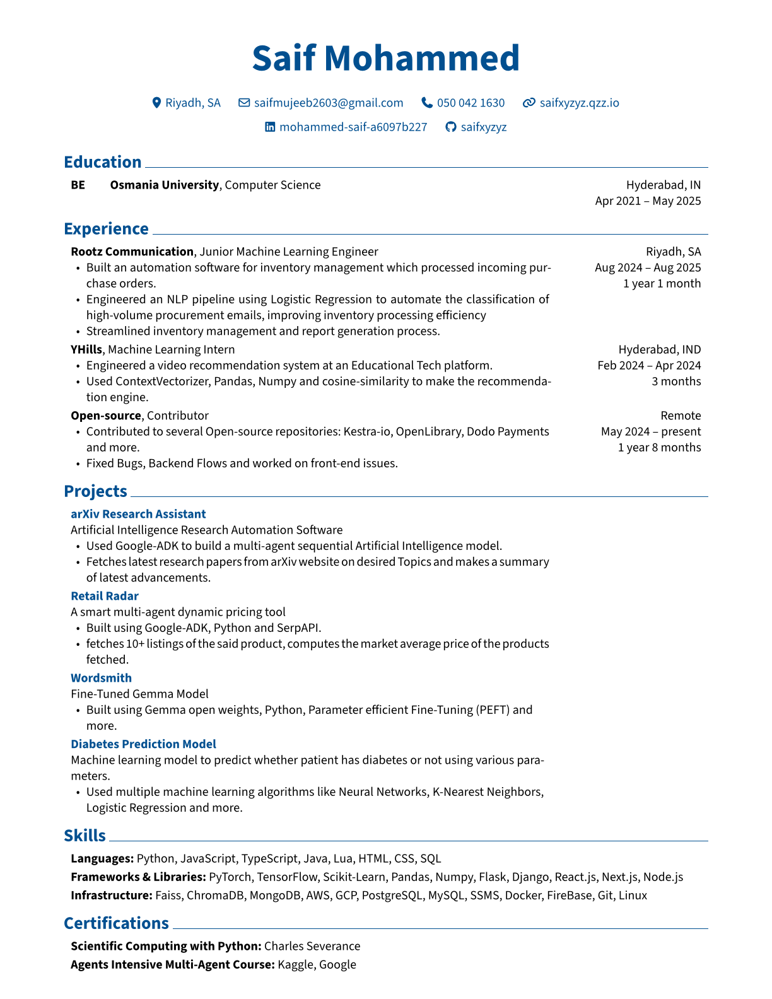

# resume
Various ways I found to make resume because I don't like using Word 

1. YAML, rendercv:  
   Install rendercv:  
  `pip install "rendercv[full]"`  
  To generate current:    
  `rendercv render "Saif_Mohammed_CV.yaml"`  
  To make new one:  
  `rendercv new "John Doe"` 
2. Python Script:  
   `python makeresume.py`
3. Latex:  
   `npm I forgot`

### Currently using the one made using [rendercv](https://github.com/rendercv/rendercv)

